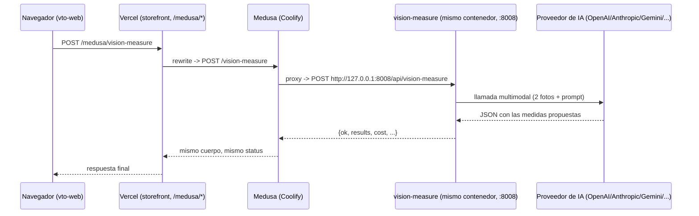

# Medición óptica con IA ("Opción 2" del try-on)

Documentación de fondo del pipeline de inferencia con IA que corre detrás de la
pestaña **"IA"** del try-on (`apps/vto-web`): dos fotos entran, medidas ópticas
(y opcionalmente una foto del paciente con la montura puesta) salen. Pensada
para que quien no participó en construirlo pueda entender cómo funciona,
extenderlo, y diagnosticar un fallo sin releer todo el código fuente.

Si solo necesitas la referencia rápida de rutas y variables de entorno, salta a
[Referencia rápida](#referencia-rápida). Si algo se rompió, salta directo a
[Incidentes conocidos](#incidentes-conocidos--lecciones-aprendidas) — es
altamente probable que ya haya pasado antes.

## Qué es esto, en una frase

El operador (o, con `VITE_ENABLE_TRY_ON=true`, el cliente) sube o captura una
foto frontal del paciente y una foto de la montura elegida; un modelo
multimodal (OpenAI, Anthropic, Gemini, Qwen, Mistral, xAI, o vía OpenRouter)
propone DIP (distancia pupilar), alturas de montaje, y opcionalmente compone
una imagen del paciente usando esa montura.

**No es un chatbot ni una conversación** — es una única llamada estructurada
por medición, con un esquema JSON fijo que el modelo debe rellenar
(`schema.py`). No hay memoria entre peticiones: cada medición se arma desde
cero con las dos fotos y el contexto de esa sesión, nunca con lo que se pidió
antes.

## Mapa: dónde vive cada cosa

```
apps/vto-web/src/
├── vision_measure_client.ts   # cliente HTTP tipado — el ÚNICO lugar del
│                               frontend que sabe la forma exacta del contrato
├── vision_measure_panel.ts    # la pestaña "IA": captura, formulario, disparo
│                               de la petición, precarga de identificador/imagen
└── vision_report_view.ts      # el informe imprimible ("Simulación y
                                mediciones"), incluida la lógica de recorte de
                                foto y las marcas de pupila

apps/backend/src/api/vision-measure/
├── proxy.ts                   # helper compartido: reenvía a 127.0.0.1:8008
├── route.ts                   # POST /vision-measure        (la medición)
├── providers/route.ts         # GET  /vision-measure/providers
├── models/route.ts            # POST /vision-measure/models
├── image-proxy/route.ts       # GET  /vision-measure/image-proxy
└── health/route.ts            # GET  /vision-measure/health

apps/vision-measure/            # código fuente real — Python/FastAPI
├── services/api/vision_api.py        # las rutas HTTP (arranca el proceso)
└── services/vision_measure/
    ├── config.py               # catálogo de proveedores + resolución de claves
    ├── providers.py            # llamada HTTP a cada proveedor + reintentos
    ├── prompts.py               # las dos estrategias de medición (A/B)
    ├── capri_prompt.py          # el protocolo Capri (identificador → dimensiones)
    ├── schema.py                 # el esquema JSON que el modelo debe rellenar
    ├── compositor.py             # la imagen del paciente con la montura puesta
    ├── measure.py                 # orquestador: junta todo lo anterior
    └── pricing.py                  # coste estimado por llamada
```

## Arquitectura: el camino de una petición

`vision-measure` (Python) **no tiene dominio propio**. Corre como segundo
proceso dentro del mismo contenedor que el backend de Medusa
(`apps/backend/docker-entrypoint.sh`), alcanzable solo en
`http://127.0.0.1:8008` — nunca expuesto a internet directamente. El storefront
siempre le habla a través de Medusa.



**Por qué está montado así y no como una app de Coolify aparte**: una app
nueva significa un dominio nuevo, un CORS nuevo, y una cosa más que mantener
arriba. Al vivir en el mismo contenedor, hereda gratis las variables de
entorno que el backend ya tiene configuradas (`ANTHROPIC_API_KEY`,
`R2_PUBLIC_URL`, etc.) — ver [Variables de entorno](#variables-de-entorno).

**Por qué las rutas no están bajo `/store` ni `/admin`**: `/store/*` exige
automáticamente `x-publishable-api-key`, y `/admin/*` exige sesión de Medusa —
ninguna de las dos tiene sentido para un proxy puro sin contexto de tienda. Por
eso `apps/backend/src/api/vision-measure/` está al nivel raíz de `src/api/`.

## Las dos estrategias de medición

| | Propuesta A — Visión directa | Propuesta B — Híbrida con landmarks |
|---|---|---|
| Qué recibe el modelo | Solo las dos fotos | Las dos fotos **+** un bloque de contexto medido localmente (DIP, escala mm/unidad normalizada, landmarks de pupilas) |
| Requiere cámara/tracking | No — funciona con cualquier foto subida | Sí — necesita una captura reciente con rostro detectado |
| Escala | El modelo la estima solo, comparando ambas fotos | Viene dada (`millimetresPerNormalizedXUnit`); el modelo **no puede contradecirla** más de 1.5 mm |
| Precisión típica | Más expuesta a error de escala | Más confiable — la escala es un hecho medido, no una estimación del modelo |
| Selector en el panel | `select-ai-strategy` → `"A"` | `select-ai-strategy` → `"B"` |
| También se puede pedir | — | `"AB"` corre ambas a la vez (llamadas concurrentes) para comparar |

El código fuente de cada prompt está en `prompts.py` (`_STRATEGY_A_BODY`,
`_STRATEGY_B_BODY`) — ábrelo si necesitas ajustar exactamente qué se le pide al
modelo.

## El protocolo Capri

Cuando el campo **"Identificador de la montura"** tiene algo con forma de
código real (letras seguidas de dígitos, ej. `DC407`), se activa el protocolo
Capri (`capri_prompt.py`): el modelo recibe instrucciones para abrir
`https://caprioptics.com/product/<código>/` y leer la fila de la tabla técnica
que corresponde al color de esta montura — A, B, ED, Circ, DBL, largo de
varilla.

- El **color** importa: una montura tiene una fila por variante de color en la
  tabla del proveedor. Por eso el identificador se compone como
  `"DC407 Black"`, no solo `"DC407"` — sin el color, el modelo no puede saber
  cuál fila leer.
- Se autocompleta solo (`vision_measure_panel.ts`,
  `applyActiveFrameId()`) a partir del SKU y color reales del producto que el
  storefront le pasó por la URL — el usuario no debería tener que escribirlo
  nunca a mano para un producto real.
- **Nunca inventa un valor.** Si no puede leer la página o no encuentra la
  fila, cada dimensión se reporta como `NOT DETECTED` (`null` en el JSON) — un
  `null` es preferible a un milímetro inventado, porque A y B alimentan todos
  los cálculos posteriores.
- No todos los proveedores pueden navegar páginas: hoy solo **Gemini**
  (`url_context`) y **OpenAI** (Responses API + `web_search`) lo soportan. Con
  cualquier otro proveedor, las medidas publicadas siempre vuelven como
  `NOT DETECTED`.

## Proveedores soportados

| id | Etiqueta | Adapter (protocolo HTTP) | Variable de entorno |
|---|---|---|---|
| `openai` | OpenAI | `openai` | `OPENAI_API_KEY` |
| `anthropic` | Anthropic (Claude) | `anthropic` | `ANTHROPIC_API_KEY` / `CLAUDE_API_KEY` |
| `gemini` | Google Gemini | `gemini` | `GEMINI_API_KEY` / `GOOGLE_API_KEY` |
| `qwen` | Qwen (Alibaba DashScope) | `openai` (compatible) | `QWEN_API_KEY` / `DASHSCOPE_API_KEY` |
| `mistral` | Mistral (Pixtral) | `openai` (compatible) | `MISTRAL_API_KEY` |
| `xai` | xAI (Grok Vision) | `openai` (compatible) | `XAI_API_KEY` / `GROK_API_KEY` |
| `openrouter` | OpenRouter (pasarela multi-modelo) | `openai` (compatible) | `OPENROUTER_API_KEY` |

Cinco de los siete hablan el mismo protocolo tipo `/chat/completions`
("adapter openai"); solo Anthropic y Gemini necesitan su propio adaptador
(`providers.py`: `_call_anthropic`, `_call_gemini`).

### Resolución de la clave

Orden de precedencia (`config.py: resolve_api_key`):

1. La clave escrita a mano en el panel (`input-ai-key`), si el operador la
   puso — **siempre gana**, incluso si hay una del entorno.
2. La variable de entorno correspondiente (tabla de arriba).
3. Si ninguna existe: `MissingApiKeyError`, que el panel muestra como
   `errorCode: "missing-api-key"` — ver [Manejo de errores](#manejo-de-errores).

`ANTHROPIC_API_KEY` **ya está puesta** en el backend (la usa también el OCR de
recetas) — `vision-measure` la hereda gratis por vivir en el mismo contenedor.
Las demás son opcionales: sin ellas, el operador simplemente escribe su propia
clave por sesión.

## El proxy de imágenes (`image-proxy`)

Precarga **"Imagen del espejuelo"** con la foto real del producto, sin que el
cliente tenga que buscarla y subirla — pero el host donde vive esa foto (hoy,
Supabase Storage) no manda cabeceras CORS, así que el navegador no puede leer
esos bytes directamente para construir el data URL que necesita la medición.
Un servidor no tiene esa restricción.

```
GET /api/vision-measure/image-proxy?url=<url-de-la-foto>
```

**Lista blanca de hosts, no un proxy abierto** — un "descarga cualquier URL que
te pida" sin restricción es un vector de SSRF (una forma de hacer que este
servidor alcance direcciones que de otro modo no podría). Por defecto acepta:

- `caprioptics.com` (hotlinks crudos del proveedor, todavía presentes en
  algunos datos de catálogo locales/de desarrollo).
- El host que resuelvan `R2_PUBLIC_URL` / `R2_ENDPOINT` — **las mismas
  variables que el backend ya usa** para las imágenes de producto (Supabase
  Storage en este despliegue). Se deriva en tiempo de arranque
  (`_default_image_proxy_hosts()` en `vision_api.py`), así que si el bucket
  cambia algún día, este proxy lo sigue solo, sin que alguien tenga que
  acordarse de actualizarlo aparte.
- `VISION_IMAGE_PROXY_ALLOWED_HOSTS` (opcional, coma-separado) **agrega** hosts
  a esos dos — nunca los reemplaza.

Reintenta una vez con una pausa de 1.5s si la primera petición falla
(`vision_measure_panel.ts: applyActiveFrameImage`) — pensado para el caso de
un contenedor recién desplegado que todavía está terminando de arrancar.

## Manejo de errores

Cada fallo trae un `errorCode` machine-readable además del mensaje. El panel
usa el código para mostrar **un mensaje genérico y traducido** — nunca el
texto técnico crudo, porque quien lo ve puede ser un cliente anónimo, no el
operador que configuró el servicio.

| `errorCode` | Cuándo ocurre | Se reintenta solo | Mensaje al usuario |
|---|---|---|---|
| `missing-api-key` | Ni el panel ni el entorno tienen clave para ese proveedor | No | "Este servicio no está disponible en este momento. Contacta con el administrador." |
| `quota-exceeded` | El proveedor respondió 429 (límite de la cuenta, no saturación general) | Sí — ver "Reintentos y backoff" | "Alcanzó su límite de uso. Intenta de nuevo en unos minutos." |
| `provider-unavailable` | El proveedor respondió 500/502/503/504 tras agotar los reintentos | Sí — ver "Reintentos y backoff" | Mismo mensaje que `quota-exceeded` (desde el cliente, da igual cuál de las dos fue) |
| `network-error` | Fallo de DNS/conexión (`requests.RequestException`) tras agotar los reintentos | Sí — ver "Reintentos y backoff" | Mismo mensaje que `provider-unavailable` |
| `timeout` | La petición agotó el tiempo límite sin respuesta | **No** — ver nota abajo | "El análisis tardó más de lo permitido. Inténtalo de nuevo." |

**El timeout no se reintenta a propósito**: la petición ya gastó todo el
tiempo asignado, y repetirla de inmediato duplicaría una espera que el
operador ya está viendo en pantalla.

La clasificación vive en `measure.py: _provider_error_code()` — si agregas un
proveedor nuevo o un código nuevo, es el único sitio que hay que tocar en
Python; el mapeo a texto traducido está en
`vision_report_view.ts: failureMessage()` + las claves `ai.*` de
`apps/vto-web/src/i18n.ts` (recuerda: **es + en**, o `check:i18n` de
capri-storefront no se entera porque vto-web tiene su propio sistema de i18n
separado — no hay chequeo automático para este archivo).

## Reintentos y backoff

`providers.py: _post_json()` — hasta `MAX_RETRIES` intentos adicionales para
los status en `RETRYABLE_STATUSES = {408, 425, 429, 500, 502, 503, 504}` y
para fallos de red. Espera entre intentos: la cabecera `Retry-After` del
proveedor si la manda, si no, `RETRY_BASE_DELAY_S * 2^intento` con jitter
aleatorio, con un techo de `RETRY_MAX_DELAY_S` (para que una flota de clientes
reintentando no convierta un pico de carga en una caída total). Un 4xx que no
sea 408/425/429 **no se reintenta** — es un problema de la petición, no algo
que vaya a arreglarse solo.

Los tres son tunables por entorno (`VISION_MAX_RETRIES`,
`VISION_RETRY_BASE_DELAY_S`, `VISION_RETRY_MAX_DELAY_S`; ver
`apps/vision-measure/.env.example`) — por defecto 6 reintentos, arrancando en
2s y con techo en 60s, siguiendo la guía de Google para 429/503 en esta misma
API. El valor anterior (3 reintentos arrancando en 3s) daba por perdida la
petición en ~15-30s, mucho antes de que un pico de saturación real (Google
mismo lo describe como "30 segundos a varios minutos") terminara — de ahí que
tres intentos escalando el tiempo casi nunca lograran respuesta.

### Avisar por correo/WhatsApp en vez de esperar

Desde el segundo intento fallido (`SLOW_NOTICE_AFTER_ATTEMPT = 2` en
`providers.py`) el panel ofrece guardar un contacto en vez de seguir mirando
la pantalla. El umbral es deliberadamente bajo: en el segundo intento no hay
forma de saber si el proveedor se recupera en 5 segundos más o si va a agotar
todo el presupuesto de reintentos (ahora mucho más largo, ver arriba), así que
se ofrece la salida de inmediato en vez de forzar a esperar para verlo. Esto
exige que la medición corra como trabajo de fondo, así que
`vision_measure_panel.ts: run()` ya no llama a `POST /vision-measure` directo:
arranca un trabajo (`POST /vision-measure/job`) y lo consulta
(`GET /vision-measure/job/:id`), que ahora también trae `progress` (intento
actual, espera, y si ya pasó el umbral) mientras el trabajo sigue `pending`.

`POST /vision-measure/job/:id/notify` guarda el contacto **en memoria, junto
al trabajo** (nada persistido — vision-measure sigue siendo "sin estado"). En
cuanto se guarda con éxito, el panel se DESENGANCHA del sondeo — dejar de
mirar la pantalla es justamente el punto — y libera el botón "Analizar" para
que el operador pueda hacer otra cosa; el trabajo en sí sigue corriendo en el
servidor exactamente igual, ajeno a si algún navegador lo sigue consultando.
Cuando el trabajo por fin termina (bien o mal), el propio proceso compone un
resumen y se lo pasa a `POST /vision-measure/notify` en el backend de Medusa,
que ya tiene Resend (email) y Twilio (SMS) configurados — WhatsApp reutiliza
el mismo proveedor de Twilio con un remitente `whatsapp:+...` distinto
(`TWILIO_WHATSAPP_FROM_NUMBER`), gateado por `VISION_INTERNAL_SECRET` en ambos
`.env`. La entrega ocurre en el servidor, así que cerrar la pestaña (o el
navegador) después de guardar el contacto no la cancela.

## Coste

`pricing.py` calcula el coste estimado de cada llamada (`estimate_cost`) a
partir de tokens de entrada/salida y las tarifas por proveedor en `RATES`
(`ratesCheckedOn` marca cuándo se verificaron esos precios por última vez —
revisar si ha pasado mucho tiempo). Cada resultado trae su propio `cost`, y la
respuesta completa trae un `cost` agregado (`summarize()`) que suma incluso las
propuestas que fallaron — un intento fallido igual gastó tokens.

A diferencia del resto de la infraestructura (Postgres, Redis, Meilisearch —
todo coste fijo), esto es **coste variable por petición**. Vale la pena
vigilarlo contra el presupuesto del proyecto antes de dejar esta opción
abierta a clientes anónimos sin ningún límite.

## La imagen compuesta (try-on)

Dos motores completamente distintos, seleccionables en el panel
(`select-ai-image-engine`):

- **`local`** (`compositor.py: render_local_overlay`) — determinista, sin
  clave de ningún proveedor. Recorta la montura de su foto (con `rembg`, o un
  respaldo por luminancia si el modelo no está disponible), la escala según
  la geometría ya medida (DIP + ancho real de la montura), y la pega sobre la
  foto original del paciente. El resultado **conserva exactamente el mismo
  encuadre** que la foto capturada — esto importa mucho para el informe (ver
  abajo).
- **Cualquier proveedor de IA** (`render_ai_tryon`) — genera una imagen nueva.
  Mejor calidad visual, pero es una **reinterpretación**: el modelo puede
  recortar o reencuadrar como quiera, así que no hay ninguna garantía de que
  conserve el encuadre de la foto original.

`TryOnResult.method` distingue cuál se usó (`"local-overlay"` vs el id del
proveedor). Esto **importa para el informe imprimible**:
`vision_report_view.ts` solo dibuja las marcas de pupila (círculos + líneas
verticales) cuando `method === "local-overlay"` — con una imagen generada por
IA, las coordenadas normalizadas de las pupilas (medidas contra la foto
original) ya no corresponden a nada fiable en la imagen reencuadrada, y
mostrar una línea "precisa" en el lugar equivocado es peor que no mostrar
ninguna.

## Cómo probarlo en local

```bash
# una sola vez
cd apps/vision-measure && uv sync

# backend de Medusa + vision-measure juntos (dos procesos, un solo comando)
pnpm dev:backend

# aparte, el storefront + el try-on
pnpm dev:frontend
```

Verificación rápida sin abrir el navegador:

```bash
curl http://localhost:9000/health                              # Medusa
curl http://localhost:9000/vision-measure/health                 # el proxy llega a vision-measure
curl "http://localhost:9000/vision-measure/providers?lang=es"    # catálogo de proveedores
```

En modo dev, `vto-web` habla **directo** con `127.0.0.1:8008` (proxy de Vite,
`apps/vto-web/vite.config.ts`) — el proxy de Medusa solo entra en juego en
producción. Para probar el camino completo tal como corre en Vercel+Coolify,
ver la sección "Simulación fiel de producción" que se cubrió durante el
desarrollo de esta función (o simplemente: apunta `VITE_MEDUSA_PROXY_TARGET`
del storefront a tu backend local y compila `vto-web` con
`VITE_VISION_API_BASE=/medusa`).

## Cómo se despliega

**No es su propia app de Coolify.** El Dockerfile de `apps/backend` instala
Python + `uv` (vía el instalador oficial de Astral — Alpine no trae Python, y
confiar en una imagen `COPY --from=ghcr.io/astral-sh/uv:*` para que sea
compatible con musl es una apuesta peor que instalarlo en el momento del
build), copia el código de `apps/vision-measure/services/` dentro de la
imagen, y `docker-entrypoint.sh` arranca los dos procesos: `vision-measure` en
segundo plano con reintento automático si se cae, Medusa al frente.

```
apps/backend/Dockerfile           # instala uv+Python, copia services/, corre uv sync
apps/backend/docker-entrypoint.sh # arranca ambos procesos
```

Redeploy de la app `backend` en Coolify = redeploy de `vision-measure`
también, porque es el mismo build. No hay un paso de deploy separado.

## Variables de entorno

Todas viven en la app `backend` de Coolify (el mismo contenedor). Ninguna es
obligatoria para que el proceso arranque:

| Variable | Para qué | Obligatoria |
|---|---|---|
| `OPENAI_API_KEY`, `GEMINI_API_KEY`, `QWEN_API_KEY`, `MISTRAL_API_KEY`, `XAI_API_KEY`, `OPENROUTER_API_KEY` | Clave de servidor para cada proveedor | No — sin ella, el operador la escribe a mano por sesión |
| `ANTHROPIC_API_KEY` | Igual que arriba, para Anthropic | No — ya está puesta (la comparte con el OCR de recetas) |
| `R2_PUBLIC_URL`, `R2_ENDPOINT` | De aquí se deriva el host permitido del `image-proxy` | Ya deberían estar puestas (las usa el resto del backend) |
| `VISION_IMAGE_PROXY_ALLOWED_HOSTS` | Agrega hosts extra al `image-proxy` | No |
| `VISION_MEASURE_INTERNAL_URL` | A dónde reenvía Medusa (`proxy.ts`) | No — por defecto `http://127.0.0.1:8008`, correcto en este despliegue |

`apps/vision-measure/.env.example` documenta el detalle de cada una.
`apps/vision-measure/.env` (el archivo real) es **solo para correr el proceso
suelto en desarrollo** — en producción no existe ese archivo; las variables
llegan del entorno del contenedor directamente.

## Extender el sistema

**Agregar un proveedor nuevo** (que hable el protocolo tipo OpenAI): un
`ProviderSpec` más en `config.py: PROVIDERS`, con su `env_keys`. Si el
proveedor puede navegar páginas web, sumarlo también a `_BROWSING_PROVIDERS` /
`_BROWSING_ADAPTERS` en `providers.py`.

**Ajustar qué se le pide al modelo**: `prompts.py` (estrategias A/B) o
`capri_prompt.py` (protocolo Capri) según cuál pieza del texto quieras
cambiar. El esquema JSON que el modelo debe devolver vive en `schema.py` —
cambiarlo ahí también implica actualizar `normalize_result()` y los tipos
TypeScript espejo en `vision_measure_client.ts`.

**Agregar un `errorCode` nuevo**: clasifícalo en
`measure.py: _provider_error_code()`, y agrega su traducción en
`vision_report_view.ts: failureMessage()` + las claves `ai.*` en
`apps/vto-web/src/i18n.ts` (es y en, a mano — no hay chequeo automático para
este archivo).

## Incidentes conocidos / lecciones aprendidas

Bugs reales encontrados construyendo esto, por si alguno vuelve a aparecer:

- **Ruta duplicada `/medusa/vision-measure/vision-measure/providers`** — el
  build de `vto-web` traía `VITE_VISION_API_BASE=/medusa/vision-measure`, pero
  el cliente (`vision_measure_client.ts`) ya agrega `/vision-measure/...` a
  cada llamada. El valor correcto es `/medusa`, sin el sufijo. Verificar
  siempre con `grep` en el bundle compilado, no solo leyendo el script de
  build — un `VITE_*` mal puesto no da ningún error de compilación.
- **"Host no permitido" en `image-proxy` con imágenes reales** — la lista
  blanca original solo tenía `caprioptics.com`, pero las fotos de catálogo en
  producción viven en Supabase Storage. Resuelto derivando el host de
  `R2_PUBLIC_URL`/`R2_ENDPOINT` en vez de una lista fija a mano.
- **`main` desincronizado de `develop`** — el backend despliega desde `main`,
  el storefront desde `develop` (ver `CLAUDE.md`, sección "Deploy split"). Un
  arreglo de `vision-measure` puede vivir semanas en `develop` sin que Coolify
  lo vea nunca, si nadie hace merge a `main`. Antes de dar un bug por "no
  arreglado", comprobar `git rev-list --left-right --count
  origin/develop...origin/main` — puede que el código sí esté arreglado y
  simplemente nunca haya llegado a desplegarse donde hace falta.
- **Condición de carrera al cambiar de producto con el try-on abierto** — React
  Router reutiliza el mismo componente `ProductDetail` entre dos URLs de la
  misma ruta; un `useState` simple para "¿está abierto el try-on?" sobrevive
  ese cambio, y un `useEffect` para cerrarlo corre *después* del render que ya
  tiene el producto nuevo — queda una renderización de por medio donde el
  iframe recibe datos mezclados (`DOMException: the document is not fully
  active`). Arreglado guardando *para qué producto* se abrió el try-on y
  comparándolo contra el producto actual **en el mismo render**
  (`ProductDetail.jsx`), sin depender de ningún efecto.
- **MediaPipe lento/caído desde CDNs externos** — el modelo de seguimiento
  facial (`face_landmarker.task`, 3.7 MB) se descargaba de
  `storage.googleapis.com`; medido en 11+ segundos y a veces con timeout
  total según la red. Auto-hospedado en `apps/vto-web/public/mediapipe/` (igual
  que ya se hacía con el decodificador Draco) — mismo origen, sin depender de
  la latencia de un tercero.

## Referencia rápida

### Endpoints (todos vía el proxy de Medusa)

| Método | Ruta | Qué hace |
|---|---|---|
| GET | `/vision-measure/health` | Confirma que el proceso interno está vivo |
| GET | `/vision-measure/providers?lang=es` | Catálogo de proveedores/estrategias/motores de imagen |
| POST | `/vision-measure` | Corre la medición (y opcionalmente el try-on compuesto) |
| POST | `/vision-measure/models` | Modelos que la clave dada puede usar, en vivo |
| GET | `/vision-measure/image-proxy?url=...` | Descarga una foto server-side (ver arriba) |

### Documentos relacionados

- `apps/vision-measure/README.md` — cómo correr el servicio suelto, contrato
  completo de rutas.
- `CLAUDE.md`, sección **"Try-on (3D probador)"** — panorama general de todo
  el probador, no solo la parte de IA.
